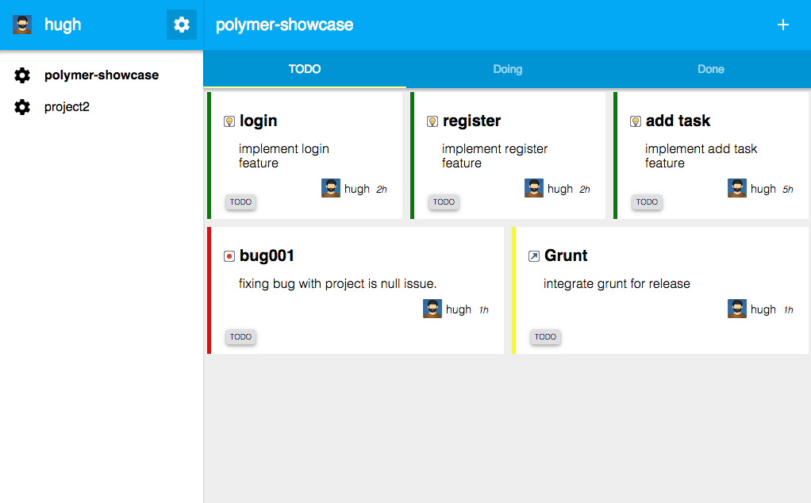

#<b>Project task manager based on polymer + angularjs</b>

##Setup Environment##
Use [bower](http://bower.io/) for package management. 
- - -
- bower install  <em>#download polymer & angularj libs</em>
- python -m SimpleHTTPServer 8999 <em>#run a simple HTTP server</em>
- http://localhost:8999/app/index.html 

##TODO##
1. For now only support localstorage for task and project management. Will integration server side. 
2. For now only support chrome for some compatible issue.

